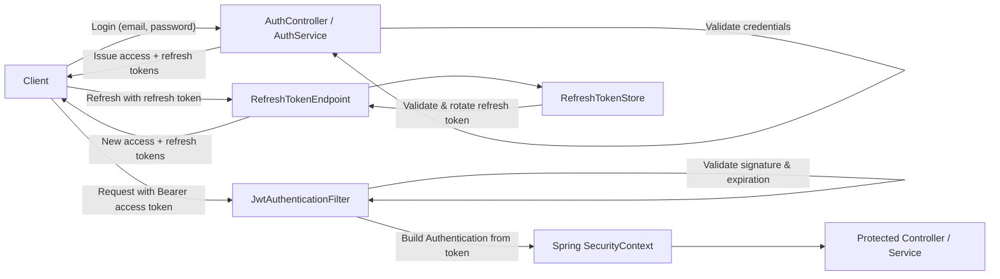

## JWT-based Security Design

This document describes the planned stateless JWT authentication and authorization model for the SpendWise API.  
It is a **design note only** – no security implementation code has been added yet.

---

## High-level overview

- **Stateless authentication (no HTTP sessions)**  
  Each request is authenticated using a Bearer access token (JWT) sent in the `Authorization` header.  
  The server does **not** store session state; Spring Security reconstructs the `SecurityContext` on every request from the token alone.

- **Access token + refresh token**  
  - **Access token**: short‑lived JWT used on every API call.  
  - **Refresh token**: longer‑lived token used only to obtain new access tokens via a refresh endpoint.  

- **Expiration & rotation strategy**  
  - Access tokens expire quickly (e.g. 5–15 minutes).  
  - Refresh tokens live longer (e.g. 7–30 days).  
  - On refresh, a new access token (and typically a new refresh token) is issued, and the old refresh token can be revoked/invalidated.

- **Role-based authorization**  
  - User roles (e.g. `ROLE_USER`, `ROLE_ADMIN`) are embedded in the access token.  
  - Spring Security maps these to `GrantedAuthority` instances for use in URL and method-level security (`@PreAuthorize`).

- **Ownership-based access**  
  - By default, a user can only access or modify resources they own (e.g. their own expenses and budgets).  
  - Ownership is enforced by comparing the authenticated user id from the token with the resource’s owner id.  
  - Elevated roles (e.g. admin) may bypass ownership checks where appropriate.

---

## Components

### Configuration & entry points

- **`SecurityConfig` (Spring Security configuration)**  
  - Enables stateless security (`sessionCreationPolicy(STATELESS)`).  
  - Registers the JWT authentication filter in the filter chain.  
  - Defines which endpoints are public (e.g. `/auth/login`, `/auth/refresh`) vs. protected.  
  - Enables method-level security annotations (e.g. `@EnableMethodSecurity`).  

- **`JwtAuthenticationEntryPoint`**  
  - Handles unauthenticated access (missing/invalid token).  
  - Returns consistent `401 Unauthorized` responses.

- **`JwtAccessDeniedHandler`**  
  - Handles requests where the user is authenticated but lacks required permissions/roles.  
  - Returns consistent `403 Forbidden` responses.

### Filters

- **`JwtAuthenticationFilter` (OncePerRequestFilter)**  
  - Runs once per request in the Spring Security filter chain.  
  - Extracts the Bearer token from the `Authorization` header.  
  - Delegates to JWT utilities/services to validate signature, expiration, and basic claims.  
  - If valid, constructs an `Authentication` object (user id + roles) and places it into the `SecurityContext`.  
  - Skips or treats differently public endpoints such as login and token refresh.

- **(Optional) `JwtExceptionFilter`**  
  - Wraps the chain to catch JWT-related exceptions (e.g. malformed/expired tokens).  
  - Converts these into standardized JSON error responses instead of generic stack traces.

### Services

- **`AuthService`**  
  - Handles login (authenticate username/email + password).  
  - Issues access and refresh tokens on successful authentication.  
  - Exposes an endpoint for refreshing access tokens using a valid refresh token.

- **`RefreshTokenService`** (if refresh tokens are stored server-side)  
  - Creates and persists refresh tokens (e.g. in a `refresh_tokens` table or cache).  
  - Validates refresh tokens on use (not expired, not revoked, matches user/metadata).  
  - Rotates refresh tokens (issuing new tokens and invalidating old ones).  
  - Supports revocation/blacklisting (e.g. on logout or compromise).

- **`CustomUserDetailsService` / `UserQueryService`**  
  - Loads user data (id, email, password hash, roles, status) from the database.  
  - Used at login time and possibly for additional checks beyond what’s in the JWT.

- **`OwnershipGuard` / `AccessControlService`**  
  - Encapsulates ownership checks and reusable access rules. Examples:  
    - `assertCurrentUserOwns(userIdFromPath)`  
    - `assertCurrentUserOwnsResource(resourceOwnerId)`  
  - Called from service methods or exposed via method-security expressions.

### Utilities & helpers

- **`JwtTokenProvider` / `JwtUtil`**  
  - Responsible for generating and validating JWTs.  
  - Functions typically include:  
    - `String generateAccessToken(User user)`  
    - `String generateRefreshToken(User user)`  
    - `boolean validateToken(String token)`  
    - `UUID getUserId(String token)` / `Collection<String> getRoles(String token)`  
  - Handles signing (e.g. HS256/RS256), issuer/audience checks, and expiration.

- **`PasswordEncoder` bean**  
  - Used to hash and verify user passwords (e.g. BCrypt).  
  - Integrated with the authentication process in `AuthService`.

- **`CurrentUser` helper**  
  - Convenience component to read the current authenticated user from `SecurityContext`.  
  - Methods like `getCurrentUserId()` and `hasRole(String role)` help services enforce ownership and role checks cleanly.

- **(Optional) Custom method-security expressions**  
  - A `SecurityExpressions` bean plus expression handler may expose helpers like:  
    - `@PreAuthorize(\"@securityExpressions.ownsExpense(#expenseId)\")`  
  - Centralizes complex authorization logic and keeps controllers/services concise.

---

## Token strategy

- **Access token**  
  - Lifetime: short (e.g. 5–15 minutes).  
  - Usage: sent on every protected API call.  
  - Claims typically include:  
    - `sub` – user id (primary identifier).  
    - `email` – user email (optional, for convenience).  
    - `roles` – list of role names (e.g. `ROLE_USER`, `ROLE_ADMIN`).  
    - `iat` – issued-at timestamp.  
    - `exp` – expiration timestamp.  
    - Optional `jti` – unique token identifier for additional tracking/blacklisting.

- **Refresh token**  
  - Lifetime: longer (e.g. 7–30 days).  
  - Usage: only for obtaining new access tokens at a dedicated `/auth/refresh` endpoint.  
  - Claims: minimal set, usually user id + `jti` + timestamps.  
  - Rotation: on each successful refresh, a new refresh token is issued and the old one is invalidated or marked as used.

- **Revocation / blacklisting (future extension)**  
  - Store active refresh tokens (and optionally access-token `jti`s) in DB or cache.  
  - On logout or suspected compromise, mark tokens as revoked.  
  - JWT validation checks whether the `jti` or token record is in a deny-list.

---

## Authorization model

- **Role-based authorization**  
  - Spring Security configuration and/or method-level annotations (e.g. `@PreAuthorize(\"hasRole('ROLE_ADMIN')\")`) enforce coarse-grained rules.  
  - Roles carried in the JWT map directly to authorities used by Spring Security.

- **Ownership-based access control**  
  - For user-scoped resources (expenses, budgets, categories, etc.), service or method-security logic ensures:  
    - The `userId` from the JWT matches the resource owner id (from path parameters or database records).  
  - Example patterns:  
    - `@PreAuthorize(\"@securityExpressions.ownsUser(#userId)\")`  
    - `@PreAuthorize(\"@securityExpressions.ownsExpense(#expenseId)\")`  
  - Administrative roles (e.g. `ROLE_ADMIN`) can be allowed to bypass ownership restrictions where necessary.

This design gives the SpendWise API a stateless, token-based authentication model with clear separation of concerns between configuration, filters, services, utilities, and authorization rules, while leaving room for future enhancements (key management, token revocation strategies, and detailed endpoint policies).

---

## Authentication and token flow (diagram)

